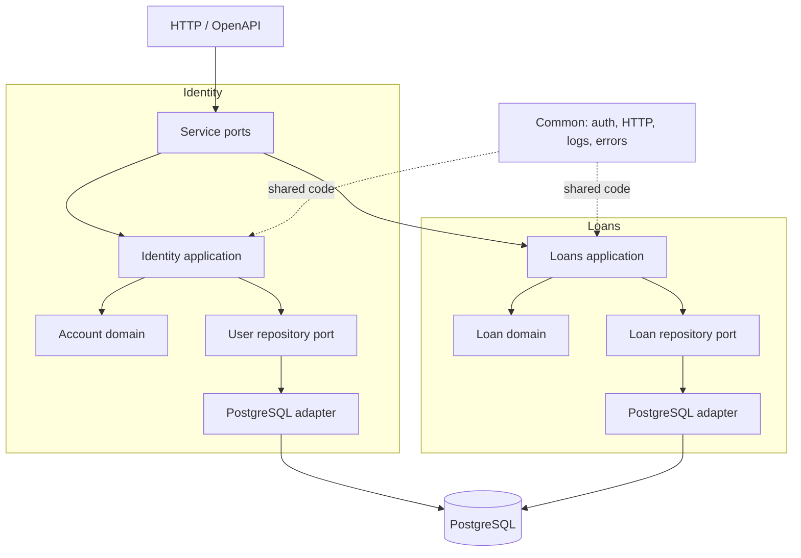

# Pinjamean

Pinjamean is an ERP built in Go with Domain-Driven Design, CQRS, and hexagonal architecture.
The current services handle identity and loan applications.

## Requirements

- Go 1.27.1
- Docker Compose

## Run

Create a `.env` file with `JWT_SECRET`, `DATABASE_URL`, and `PORT`.
From the app container, `DATABASE_URL` must use `postgres` as the host.

```sh
docker compose up --build
```

The HTTP service listens on `PORT`. Compose maps port `7777` on your machine.
Apply the SQL migrations in `migrations/` to PostgreSQL before using the service.

## Test

```sh
go test ./...
```

Run this command from the repository root.

## Architecture



Each service separates business rules from infrastructure.
Application commands and queries coordinate use cases.
Repository ports connect the application to PostgreSQL adapters.
`internal/common` provides shared authentication, HTTP, logging, and error handling.
